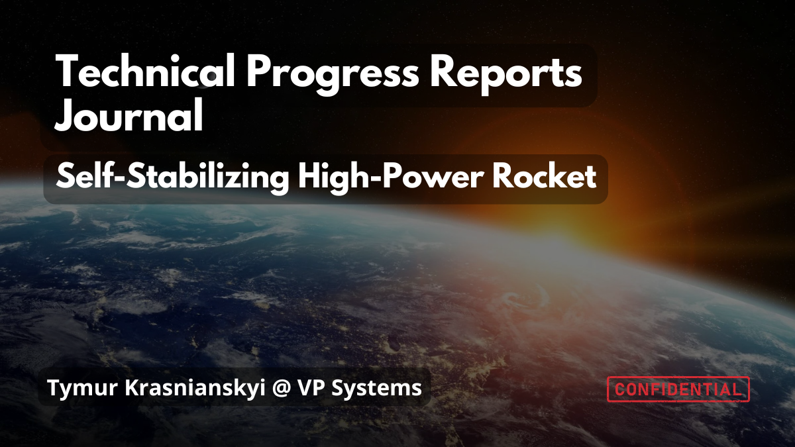
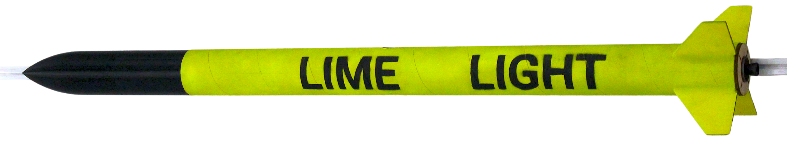
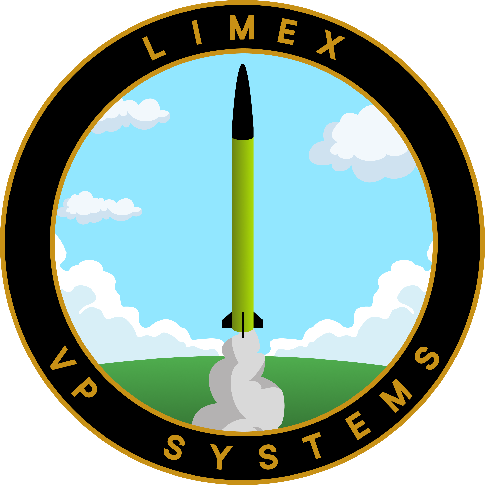
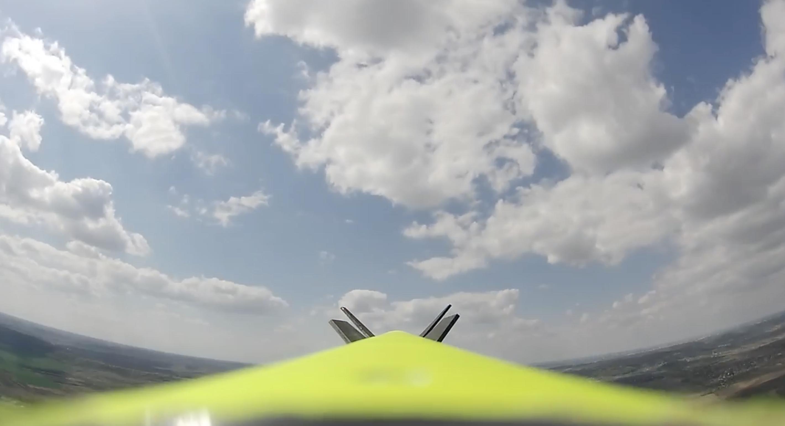
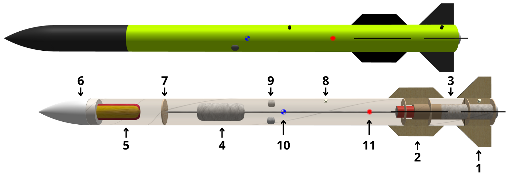

# VP Systems

## Repositories:
### <a href="https://github.com/VehiclePropulsionSystems/Zest">«Zest» Flight Controller</a>
### <a href="https://github.com/VehiclePropulsionSystems/StaticFireTestStand">Static Fire Test Stand V1</a>
### <a href="https://github.com/VehiclePropulsionSystems/CosmicLand">«CosmicLand» Ground Station</a>

## Scientfic Works
### Thesis «Development of a hardware and software complex for a self-stabilizing high-power rocket»

Author: <a href="https://www.linkedin.com/in/tymur-krasnianskyi-5b66aa211/">Tymur Krasnianskyi</a>

Supervisors:
- <a href="https://wiki.lpnu.ua/wiki/%D0%93%D0%BE%D0%B3%D0%BE%D0%BB%D1%8E%D0%BA_%D0%9F%D0%B5%D1%82%D1%80%D0%BE_%D0%A4%D0%B5%D0%B4%D0%BE%D1%80%D0%BE%D0%B2%D0%B8%D1%87">PhD. Petro Gogolyuk</a>
- <a href="https://www.linkedin.com/in/%D1%96%D0%B3%D0%BE%D1%80-%D0%B2%D0%BE%D0%B2%D1%87%D1%83%D0%BA-0aaa2195/">MS. Ihor Vovchuk</a>

### Abstract
In the recent years, the high-power rocketry community has grown significantly, driven by decreasing costs of electronic components and the increasing accessibility of design and experimental tools. As vehicles grow larger, maintaining a stable flight path becomes critical, requiring the development and integration of active control systems to compensate for external disturbances and production imperfections.

This thesis aims to design, develop, and validate a solid-fuel high-power rocket capable of autonomous in-flight stabilization, real-time data collection, and safe recovery. The development process included embedded software design, real-time control algorithms, communications, and custom propulsion systems. Extensive ground testing, static fire tests, and full-scale flight tests were conducted to iteratively improve the system's performance.

The project resulted in a working prototype flight platform demonstrating successful launch sequences, flight event detection, telemetry transmission, and real-time control pipeline operation.

This work contributes a structured methodology for developing actively controlled high-power rockets, addressing a gap in publicly available experimental resources. It establishes a foundation for future research in multi-axis guidance, real-time flight control, and autonomous navigation for amateur and academic rocketry projects.

Please proceed with caution and abide local regulations. 

### Bibtex Citation
If you use any ideas from the paper or code from our repos, please consider citing:
```
@misc{krasnianskyi2025rocket,
  author       = {Tymur Krasnianskyi},
  title        = {Development of a Hardware and Software Complex for a Self-Stabilizing High-Power Rocket},
  year         = {2025},
  note         = {Bachelor's thesis, Ukrainian Catholic University},
  url          = {https://github.com/VehiclePropulsionSystems},
}
```

### Technical Reports Journal
Special High-Power Rocketry Journal Issues:
<a href="https://drive.google.com/drive/folders/1wzRSguSC4xJzmtxK_n2-tJ-JkElodj3I?usp=sharing">Google Drive</a>



## Missions
### «Lime Light»
Our first Unguided Launch Vehicle

Results and Observations:
- Successful remote ignition and initial stability from launch rail.
- Effective drone-based external video recording.
- Functional avionics operation and data logging prior to critical event. 
- Motor retention performed as intended.
- ZEST flight controller survived significant impact forces.
- **Apogee: ~80 meters**

Identified Issues:
- Shutdown of avionics due to motor CATO.
- Failure of the recovery system to deploy following loss of power.
- Mechanical damage to key components (body, motor, nosecone, avionics mount- ing).
- Loss of onboard camera memory cards.

### «Lime X»
Our first Guided Tail Fin-Controlled Launch Vehicle


During the flight, the rocket reached an **apogee of 296 meters**. The flight controller correctly detected the trigger and transitioned into
active roll control mode mid-flight.
Flight data and ground video footage indicated that roll control behavior was
initiated successfully:
- An initial roll of approximately 40º was observed at liftoff.
- Following control activation, roll direction changed from clockwise to counter-clockwise, consistent with control system engagement.
- Maximum fin deflections of 5º were recorded, though this was later determined to be suboptimal and contributed to excessive roll response.

Flight Test successfully validated the RM-3 motor performance, the upgraded wiring and physical connections, and nominal operation of the LTE-based telemetry link. The excessive roll control authority will have to be fixed with fine PID tuning and/or fin size adjustment for future flights.

Mission Patch:




### «Lime Light Asterix»
Lime Light Asterix is an Unguided vehicle, build to test the improvements from the launches of Lime Light and Lime X. It has reached an estimated **apogee of 359 meters**, has fired a pyrocharge for the main chute, which was unable to deploy due to a mechanical failure.

<p float="left">
  
  
</p>

### «Lime X-M»
Lime X-M is a next generation of our Guided vehicles, it has all the features of Lime Light Asterix plus a new fin configuration. The fin can was divided into two parts, with mid-body static fins for better stability and smaller tail fins for more precise control. 


Lime X-M layout: 

1. Control Surfaces
2. Stabilizers
3. Motor 
4. Avionics 
5. Parachute 
6. Nose Cone
7. Separation Point
8. Rail Button
9. Onboard Cameras
10. Center of Gravity
11. Center of Pressure

*Launch coming soon...*

### Project «Freedom»
Part of our journey to **European Rocketry Challenge 2025** (<a href="https://euroc.pt/">EuRoC</a>)  \
Coming soon...